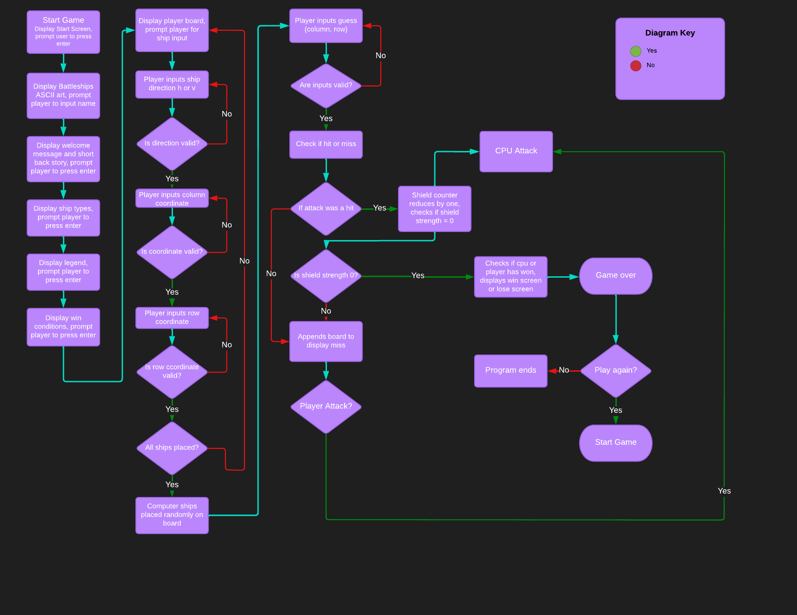

# **Battleships 1977**
## **Overview**

Battleships 1977 is a python-based version of the classic Battleships board game. In this particular iteration of the game, the user plays against the computer in a turn-based competition where the objective is to eliminate all of the opponent's ships before their own are destroyed.

There are four ships ranging from one tile in length up to a length of four tiles. When either the user or cpu hits and destroys all of the opposing ships, the game is over.

This edition of the game has been loosely based on the popular sci-fi series 'Star Wars' The original movie was released in 1977, hence the appendage to the title of the game.

It features space-based ASCII art, and contains various references to characters, vessels and ideologies from the movie. The intention was to provide a fresh and different setting to the classic game which is situated in an ocean and played with contemporary seafaring vessels such as aircraft carriers and frigate etc.

The user is guided through some Star Wars-related imagery and text before being prompted to enter their name. The rules and legend are presented before the game requests the user place their ships on the board. There is the option to place the ships horizontally or vertically, and then the use must decide on x and y coordinates to assign the relevant ship.

The CPU ships are assigned random coordinates. The game is designed so that the user goes first. Upon completion of the game, the user is presented with a screen informing them that they have either won or lost. Then they are asked if they wish to play again or quit.

Clear [here](https://battleships-1977.herokuapp.com/) to see the final deployment of the game

​
## Table of contents:
1. [**Site Overview**](#site-overview)
1. [**Planning stage**](#planning-stage)
    * [***Target Audiences***](#target-audiences)
    * [***User Stories***](#user-stories)
    * [***Site Aims***](#site-aims)
    * [***Wireframes***](#wireframes)
    * [***Color Scheme***](#color-scheme)
    * [***Typography***](#typography)
1. [**Current Features Common to all pages**](#current-features-common-to-all-pages)
    * [***Header Element***](#header-element)
    * [***Other Features***](#features)
    * [**Footer**](#footer)
1. [**Individual Page Content features**](#individual-page-content-features)
    * [**About Page Content**](#about-page-content)
    * [**Teachings Page Content**](#teachings-page-content)
    * [**Community Page Content**](#community-page-content)
    * [**Contact Page Content**](#contact-page-content)
    * [**Form Feedback Page Content**](#form-feedback-page-content)
1. [**Future-Enhancements**](#future-enhancements)
1. [**Testing Phase**](#testing-phase)
1. [**Deployment**](#deployment)
1. [**Tech**](#tech)
1. [**Credits**](#credits)
    * [**General reference**](#general-reference)
    * [**Content**](#content)
    * [**Media**](#media)
    * [**Honorable mentions**](#honorable-mentions)
​
## **Planning Stage**

 

#### **Target Audiences:**
* People who like the classic Battleships​ game.
* People who are looking for a science-fiction-based take on the classic game.
* People looking for an online version of the game.
* People who are fans of Star Wars.
* Aspiring coders looking for a simple but effective code.

​
#### **User Stories:**
* As a user, I want to understand the premise of the game.
* As a user, I want to quickly learn and understand the rules of the game and its instructions.
* As a user, I want a clean and simple user interface (UI).
* As a user, I want the game to run smoothly and bug-free.
* As a user, I want to be able to choose whether or not to play again when the game ends.
* As a user, I want to be able to win against the computer.

​
#### **Site Aims:**
* To offer the user a smooth and bug free version of a classic game with a slightly different twist.
* To provide a clean and simple interface for the user with no need to reference external sources.
* To provide clear instructions and a win condition.
* To provide an enjoyable user experience of playing battleships.
* To provide an interesting and entertaining Star Wars-based version of the game.

#### **Lucid Chart:**

To help with the planning stages​​ of this project, I used [LucidChart](https://www.lucidchart.com)
This proved to be very useful tool when it came to visualising the various processes involved in recreating a Battleships style game. Whilst the concept is quite simple, the logic involved proved slightly more difficult.

This is the flow chart which assisted the development of the game:

#### **Wireframes:**

Wireframes for each of the different screens were created using Balsamiq. This process provided a basic but clear outline of how each page would look as well as organising the content.

* Splash Screen
[Splash Screen Wireframe](assets/images/hyperCube-splash-wireframe.png)

* Game Screen
[Game Screen Wireframe](assets/images/hyperCube-game-wireframe.png)

* Start Game and Leaderboard Card
[Start Game](assets/images/hyperCube-overlay-card-wireframe.png)

 ​

#### **Colour Scheme:**
​

 

The splash screen uses the radial gradient desrcibed above which is dark at the edges and lighter towards the centre. The font color used is white which contrasts starkly to the background and provides a clean introduction to the page. It makes the text stand out and it is easily readable. The borders of the boxes are slightly darker (#DADBD0) which provides a softer mid-point between the text and background.

The game page uses the same radial gradient but there is animated effect of stars drifting upwards. This is to emphasise the location and setting of space as well as to offer an insight into the physical laws of the fictional alternate universe. I applied the same gradient to the buttons on the overlay card and I think it looks good. Again the colors are dark to allude to the science-fiction/space context. They work well with the canvas background image.

​
#### **Typography**
​
* Throughout the page and game, the following fonts are used:
  * IBM Plex Mono (Regular 400) ('https://fonts.google.com/specimen/IBM+Plex+Mono?query=IBM+Pl') - This font was chosen to complement the sci-fi feel of the game and site. 
  * Monospace - As a fallback font in the event IBM Plex Mono wasn't supported by the browser
​
* All fonts were sourced from Google fonts, as stated in the credits.

​ 

## **Current Features Common to all Pages**

#### **Favicon**

* The favicon is a small image that displays in the browser tab. 
* The intention is to enhance the user experience for those who have multiple tabs open and cannot read the text in the tabs.
* The favicon is a simple lower case 'h' and upper case 'C' to reflect the styling of 'hyperCube' in the title of the game. The font color is the same (#DADBD0) as the one used on the splash and game screens, whilst the purple is found in the game canvas background.
* For consistency, the font used is IBM Plex Mono.

​
#### **Toggle Music Button:**
​
* On both the splash screen and game screens, there is the option to toggle the music and game sound effects. This gives the user the option of starting the music as soon as the page has loaded. The music is atmospheric and helps to set the scene. If the user would prefer not to start the game with music, then they do not have to interact with the buttons at all but are free to do so later via a button on the canvas screen which performs the same function.
* The buttons are responsive and respond to touch and mouse clicks.

​

## **Features**
​
#### **Splash Screen** 

* The splash screen features a gradient background featuring the colours outlined above.
* There is an h1 heading featuring the title of the game.
* The music and SFX button is below the heading. By default, the music and SFX do not play. The button will toggle both.
* The synopsis is in a bordered div and gives a brief story for the user in order to engage them in the game.
* Beneath the synopsis is a countdown timer which counts from 20 seconds to zero, giving the user time to read the synopsis and/or toggle the music.
* FInally, there is a skip button which gives the user the option of skipping the splash screen entirely, either when they are ready or if they have visited the site on multiple occasions.
* All text is white (#FFF) to offer a contrast to the background and the borders are slightly softer (#DADBD0) to offer a softer contrast.

#### **Game Start Screen** 

* Once the splash screen has counted down or been skipped, the game screen presents the user with the game canvas which is partially covered with the overlay card. The card features a start button which starts the game.
* There is also a toggle music button which works in the same manner as the one on the splash screen. As there will be too little time to adjust these effects during gameplay, it makes most sense to have the button situated here.
* The card also features the leaderboard which utilises local storage to save the top 5 high scores. The scores will remain in the browser on refresh and restart.
* The clear button will remove all saved high scores from local storage ready for the table to be populated anew.
* The background for this screen is a CSS animation which features small stars drifting slowly upwards. It was important to choose a background that wasn't too demanding in terms of processing power as well as one that minimised distraction during gameplay. However, I feel it contributes well to the overall atmosphere and immersion in the game. 

#### **The Game Itself** 

* Upon start, the player character (the white square) appears to move towards the black 'monoliths'. In terms of the game logic, it is actually only the monoliths that move.
* The player character jumps through a press of the spacebar or a screen tap on mobile devices. Upon jumping the player character executes a perfect 360 degree jump.
* For every 10 blocks that are successfully jumped, the speed of the black monoliths increases.
* The player scores a point for every obsatcle that is successfully cleared.
* As it is an endless jumper, the goal is to score highest on the leaderboard. 
* If the player achieves a top 5 high score they are prompted to enter their name in the leaderboard. Alternatively, they can click cancel which logs 'Anonymous' to the leaderboard.

 

​
## **Future-Enhancements**
​
There are a several areas with scope for future improvement. This project has been fun and challenging and I will continue to try to add the following features in my own time:
​
* Creating a sprite and sprite sheet for the player character.
* Additional sound effects.
* Add different types of obstacle or enemy.
* The ability to collect items whilst jumping.
* Platforms to jump on to.
* The abiity to collect an item which slows down the obstacles temporarily.
* The ability to move left and right.
* Adding a parallax background.
​
## **Testing Phase**
​
**Responsiveness**

* Responsiveness was tested extensively using Chrome Dev Tools. This proved invaluable when creating each page and was instrumental in helping me ensure responsiveness on multiple devices and screen sizes. The ability to experiment with the code saved a lot of trial and error within gitpod.
* User testing was conducted on the following devices: Apple iPhone 12, Apple iPad Air 2021, Apple Macbook Air 2021, Apple MacBook Pro 2021. 
* As I was limited to Apple devices only I sent the link to various friends and colleagues so they could check responsiveness on further devices including Windows desktop PCs, Amazon tablets and Samsung Galaxy S12. In each case, the pages responded as expected.
* Using CSS grid was hugely helpful when it came to the splash screen and it resizes well regardless of the device.
* When resizing the window using Chrome Dev Tools, from 415px and narrower, it may appear that the splash screen becomes crowded with a lot of space at the bottom of the screen. This is necessary to take into account the browser bar on mobile devices. 

* **Splash Screen**

* **Game Screen**

​

**Functionality**

* Each feature was user-tested numerous times. All buttons or links were clicked or tapped and images checked.
* On desktop and mobile, all buttons and controls function perfectly. The music and SFX toggle on and off as expected. 
* The javascript functions as intended on desktop and mobile. 
* The skip button functions perfectly regardless of the device.
* The animated background functions well on desktop and mobile.
* The game runs as expected on desktop and mobile. 
* The leaderboard functions as intended on desktop and mobile. 
* I used *Lighthouse* to test each page. Results below:

* 
* 

* The page performs well.
* The desktop score performance score is 99% and the mobile score is 86%.
* The game scores 100% in terms of accessibility, best practices and SEO.

​
**Validators**

* HTML Validation using w3c validator -  passed validation

* 

* CSS Validation using w3c jigsaw - passed validation

* 

* JavaScript Validation using jShint - passed validation with no major issues. The report states that there are two unused variables but they are integral to the game and called from the DOM. There are two warnings which refer to ternary expressions.

* 

​
​
## **Bugs**
​
The following bugs were identified during user testing:

* 🐞 - At first it was not possible to get the music to play on any device.
* ⚒️ - The file was unplayable when situated in my assets or audio folder.
* ✅ - I added the audio file to the root directory and it worked.

 

* 🐞 - The SFX ran by default on all devices which could be undesirable for many users.
* ⚒️ - The corresponding JS function specified volume on page load.
* ✅ - Set the volume to zero until the user clicks or taps the toggle music and SFX button

​ 

* 🐞 - The game music had a hissing sound which affected the user experience.
* ⚒️ - I used a .wav file which had become distorted after compression.
* ✅ - Converted to an .mp3 file which was smaller than the compressed .wav file but sounds fine.

 

* 🐞 - The original SCSS background worked well on a MacBook Pro but caused huge lag and unplayable game quality on some devices.
* ⚒️ - The SCSS was too CPU intensive on some devices.
* ✅ - I used a different background animation which was more subtle but works on all devices in testing.

 

* 🐞 - The game was initially too hard.
* ⚒️ - The speed of each block was too fast.
* ✅ - Slowed the starting speed of the blocks and set them to move incrementally faster.

 

* 🐞 - The skip button on the splash screen would be hidden by the browser bar on smaller mobile devices. This meant users who had played the game multiple occasiosn would have to wait for the countdown to finish.
* ⚒️ - Whilst the page is responsive it dodn't take into account the browser bar.
* ✅ - Adjusted the CSS grid spacing to take into account screen sizes of 415px and smaller which accounts for mobile devices.

 

* 🐞 - The score SFX would not play on loading of the page which was as intended, however upon toggling sound on and off it would continue to play even when the music and jump SFX would be muted.
* ⚒️ - The score SFX had been tied to intricately to the game itself.
* ✅ - I had been uncertain about the score SFX and although it worked well on desktop, there was sometimes a lag on certain mobile devices so I removed it altogether.

 

## **Unfixed Bugs**

* There is an issue when running the game in mobile compatibility mode on Dev Tools. The following error is logged to the console upon simulation of a touch event: "Unable to preventDefault inside passive event listener due to target being treated as passive." Although I was able to fix this, when I ran the game on Apple touch devices, the jump function no longer worked so it was not a viable solution.
The bug does not affect the playability or performance of the game or page in any way, but this remains a minor bug for the time being.
* One potential issue is on displays running at 120hz: the game works best at 60hz but will run faster if the screen refresh rate is at 120hz or higher. This isn't an issue for the majority of devices but it is important to note. Given more time, this is something I would investigate further.

## **Deployment**
I deployed the page on GitHub pages via the following procedure: -
​
1. From the project's [repository](https://github.com/AndypSheridan/hyperCube), go to the **Settings** tab.
2. From the left-hand menu, select the **Pages** tab.
3. Under the **Source** section, select the **Main** branch from the drop-down menu and click **Save**.
4. A message will be displayed to indicate a successful deployment to GitHub pages and provide the live link.
​
The live site can be found can be found at the following URL - https://andypsheridan.github.io/hyperCube/

## ***Final Deployment to Heroku:***  
  
The project was deployed to [Heroku](https://www.heroku.com) using the below procedure:-    
  
1. **Log in to Heroku** or create an account if required.
1. **click** the button labeled **New** from the dashboard in the top right corner, just below the header.
1. From the drop-down menu **select "Create new app"**.
1. **Enter a unique app name**. I combined my GitHub user name and the game's name with a dash between them (dnlbowers-battleship) for this project.
1. Once the web portal shows the green tick to confirm the name is original **select the relevant region.** In my case, I chose Europe as I am in the UK.
1.  When happy with your choice of name and that the correct region is selected, **click** on the **"Create app" button**.
1. This will bring you to the project "Deploy" tab. From here, navigate to the **settings tab** and scroll down to the **"Config Vars" section**. 
1. **Click** the button labelled **"Reveal Config Vars"** and **enter** the **"key" as port**, the **"value" as 8000** and **click** the **"add"** button.
1. Scroll down to the **buildpacks section of the settings page** and click the button labeled **" add buildpack," select "Python," and click "Save Changes"**.
1. **Repeat step 11 but** this time **add "node.js" instead of python**. 
   * ***IMPORTANT*** The buildpacks must be in the correct order. If node.js is listed first under this section, you can click on python and drag it upwards to change it to the first buildpack in the list.
1. Scroll back to the top of the settings page, and **navigate to the "Deploy" tab.**
1. From the deploy tab **select Github as the deployment method**.
1. **Confirm** you want to **connect to GitHub**.
1. **Search** for the **repository name** and **click** the **connect** button next to the intended repository.
1. From the bottom of the deploy page **select your preferred deployment type** by follow one of the below steps:  
   * Clicking either "Enable Automatic Deploys" for automatic deployment when you push updates to Github.  
   * Select the correct branch for deployment from the drop-down menu and click the "Deploy Branch" button for manual deployment. 

The final deployment can be viewed [here](https://battleships-1977.herokuapp.com/)
​
## **Tech**
​
I used the following technologies for the Battleships 1977 project:
​
- Python

## **Software**

The following software was used:

- Gitpod and VS Code to create, load and push my code to Github.
- Git (Gitpod and Github) as my version control for the site.
- Heroku to deploy the project.
- Lucid Chart to develop the logic for the project.
- https://patorjk.com/ to develop the ASCII art for the project
​

 

## **Credits**
​
### **Content:**

* Core elements of the game mechanics use code written by YouTube user in the following video: Qixotl LFC https://www.youtube.com/watch?v=gnPekEXhkys

* Whilst the game is now very different, this video gave me a good platform to create a very basic jumping game. Code has been attributed in the JavaScript file.

* The leaderboard code is from the website Developer Drive: https://www.developerdrive.com/html5-javascript-gem-game-with-saved-scoreboard/

### **Media:**

* The background CSS code and HTML is copied from Riley Pearce on CodePen: https://codepen.io/riley-pearce/pen/OJWPjZM?fbclid=IwAR2HwzINeVhFg7-YQvFDV8Teh-IH6akXO9RY3uMTapRobDt-R9fJ6-GIMkY

* The in-game jump SFX is from open source digital library https://archive.org/
Here is the link: 
Jump SFX: https://archive.org/download/jump_20210424/jump.wav

* The game canvas background image was found on Freepik by Upkylick. The attribution is on the game screen. 
The URL is "https://www.freepik.com/free-vector/cosmic-background-alien-planet-deserted-landscape-with-mountains_13924256.htm#query=game%20background&position=12&from_view=keyword"

* The in-game music is freeware from Christopher at IndieGameMusic.com. 
Here is the link to the file: https://www.indiegamemusic.com/viewtrack.php?id=5620

* The favicon was generated using the online favicon generator at: https://favicon.io/

### **Honorable mentions**
* Thank you to my mentor, Richard Wells, who gave a significant amount of his time to provide me with help, feedback and ideas on the project; he has been invaluable in so many ways and a genuine source of motivation for me.
* Thanks to Code Institute for providing me with some basic knowledge of JavaScript.
* Thanks also to Codecademy which I used alongside to help reinforce my knowledge.
* Thanks to the Code Institute community on Slack who helped remind me that everyone has difficult days.
* A huge thank you to my partner Jess who is better at the game than me.
* Thanks to my oldest son Arthur who said the game was too hard to begin with, but learned that perseverance pays off in the end!